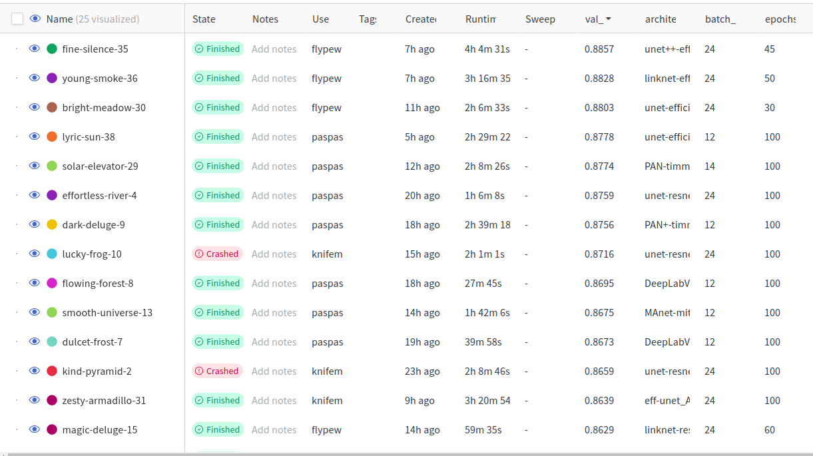

# Satellite Building Segmentation

*Solution of ThreeNearestNeighbours team*

## General pipeline

### Preprocessing

We split the initial images into chunks of size 256x256 and then apply various augmentations, including 90-degree rotations, horizontal and vertical flips and changing color

For this purpose we created a custom dataset class `SegmentationDataset` which is located in `Utils/segmentation_dataset.py`

`Utils/augmentations.py` contains extended set of augmentations used to reduce overfitting 

### Training

#### Classic Models

We utilize the vast set of classic segmentation models (Unet, Linknet, PAN, DeepLabV3) with different backbones (ResNet, EfficientNet, etc.). 
File `Utils/segmentation_model.py` contains easy-to use training loop implementation with automatic logging.

For rapid experimentation we used `segmentation_models_pytorch` library, which provides easy-to-use API for training and inference.
To track experiments we used Weights&Biases service:

The best score was achieved with `Unet++` model with `efficientnet-b5` backbone - `~0.76` for building class and `~1.0` for background class

train.ipynb

#### Ensemble

TODO

### GAN approach

We noticed that even though the data layout was mostly rectangles, the segmentation model tended to predict rough masks.
We came up with the idea to fix this using GAN.

We created a discriminator that predicts whether it is a labels mask or whether the mask was generated by the neural network.
We simultaneously trained the segmentation model and the discriminator: for the segmentation model we summed up the dice loss and loss from the discriminator (BCE loss).
We want the discriminator to predict that our model's mask is from the dataset.

As a result, on the validation this increased metrics by a couple of percent.

GAN.ipynb

### Reproducing the results

File `pedict.py` contains script with various arguments to run all available models on any data. 
To use it, first execute `get_ds_and_models.sh` script to download all necessary data and models.
Then execute `python predict.py --path_to_pics data/test/images/ --path_to_predictions  data/test/predictions --path_to_models models/ --device cuda` to run all models on test data.

After that, predictions folder will contain subfolders with predictions for all models.

You can also compute mectrics by providing `--path_to_masks` argument with path to ground truth masks

## Results

TODO

## What didn't work

TODO